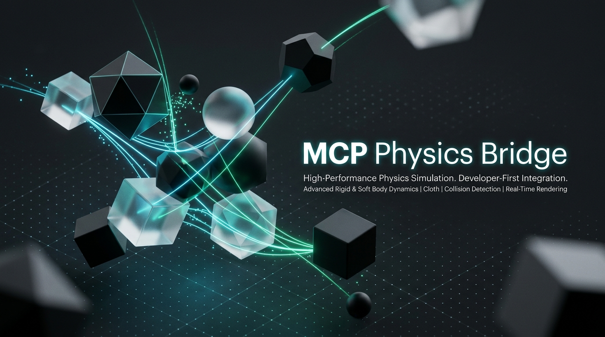

# mcp-physics-bridge

<p align="center">
  
</p>

<p align="center">
  <a href="./LICENSE"></a>
  <a href="https://github.com/epicbrain-dev/mcp-physics-bridge/actions/workflows/ci.yml"></a>
  <a href="https://nodejs.org/"></a>
  <a href="https://modelcontextprotocol.io"></a>
  <a href="./tests"></a>
</p>

<p align="center">
  <b>An engine-agnostic middleware server bridging probabilistic AI reasoning with deterministic 60 FPS game physics via gRPC, WebAssembly (Wasm), and Struct of Arrays (SoA).</b>
</p>

---

## Table of Contents

- [Core Highlights](#core-highlights)
- [Architecture Overview](#architecture-overview)
- [Quickstart (Zero Configuration)](#quickstart-zero-configuration)
  - [AI Editor Integration (Claude Desktop & Cursor)](#ai-editor-integration)
  - [CLI Flags & Daemon Mode](#cli-flags--daemon-mode)
- [Game Engine Integrations](#game-engine-integrations)
- [Observability & Monitoring](#observability--monitoring)
- [Production Deployment](#production-deployment)
  - [Environment Variables](#environment-variables)
  - [Docker & Docker Compose](#docker--docker-compose)
- [Development & Verification](#development--verification)
- [Architecture Roadmap](#architecture-roadmap)
- [Community & Governance](#community--governance)

---

## Core Highlights

<table>
  <tr>
    <td width="50%">
      <h3>⚡ 60 FPS High-Throughput Streaming</h3>
      <ul>
        <li><b>Struct of Arrays (SoA):</b> Flat, contiguous <code>Float32Array</code> views eliminate Array-of-Structs GC pressure.</li>
        <li><b>16.6ms Budget:</b> Benchmark-verified transformation of 10,000 entities in &lt;6ms.</li>
        <li><b>Protocol-Splitting:</b> HTTP/2 gRPC bi-directional streaming for native engines + Token-secured WebSockets for browsers.</li>
      </ul>
    </td>
    <td width="50%">
      <h3>🛡️ Deterministic Sandbox & Authority</h3>
      <ul>
        <li><b>Wasm Isolation:</b> AI-generated AssemblyScript physics step kernels execute in memory-sandboxed WebAssembly.</li>
        <li><b>Dual State Authority:</b> <i>Playtest Mode</i> (soft-clamping & micro-dilation) vs. <i>Debug Mode</i> (strict bitmask rejection).</li>
        <li><b>Dual-Payload Delivery:</b> AI emits both human-auditable source code and pre-compiled Wasm bytecode.</li>
      </ul>
    </td>
  </tr>
  <tr>
    <td width="50%">
      <h3>🧠 Model Context Protocol (MCP)</h3>
      <ul>
        <li><b>Tool Suite:</b> 9 specialized tools for compiling, testing, inspecting, and validating physics state.</li>
        <li><b>BYOK LLM Routing:</b> Plug-and-play support for OpenAI, Anthropic, Gemini, Ollama, and offline deterministic mock providers.</li>
        <li><b>Reflective Memory:</b> Automated AST diffing and error logs provide instant feedback to AI agents on failure.</li>
      </ul>
    </td>
    <td width="50%">
      <h3>🏃 AI-to-Rig Animation Synthesizer</h3>
      <ul>
        <li><b>Intent Mapping:</b> Translates high-level prompts into skeletal weights across 5 genre templates (FPS, RPG, etc.).</li>
        <li><b>Priority Arbitration:</b> Multi-track skeletal arbitration (Full Body, Lower Body, Additive) with interruption rules.</li>
        <li><b>Procedural Playback Scaling:</b> Physics-authoritative scaling ($s = v_{\text{actual}} / v_{\text{nominal}}$) eliminates foot sliding.</li>
      </ul>
    </td>
  </tr>
</table>

---

## Architecture Overview

```
+-------------------------------------------------------------+
|                        Game Engine                          |
|         (Unity / Unreal / Godot / Phaser / Custom)          |
+-------------------------------------------------------------+
         |                                           ^
         | [Native: HTTP/2 gRPC Stream]              |
         | [Web: WebSocket (Token Auth)]             | [Blend Weights /
         v                                           |  Playback Scale]
+----------------------------------------------------+--------+
|                 mcp-physics-bridge                 |        |
|                                                    v        |
|  +------------------------+    +-------------------------+  |
|  |  Data Translation Layer|    | AI-to-Rig Synthesizer   |  |
|  |  (SoA <-> Scene Tree)  |    | (Intent / Priority)     |  |
|  +------------------------+    +-------------------------+  |
|              |                             ^                |
|              v                             |                |
|  +------------------------+    +-------------------------+  |
|  |  State Authority Guard |    | In-Memory Wasm Sandbox  |  |
|  |  (Playtest vs Debug)   |--->| (AssemblyScript Engine) |  |
|  +------------------------+    +-------------------------+  |
|              |                             ^                |
|              v                             |                |
|  +------------------------+    +-------------------------+  |
|  |  Keyframe RAG Store    |    | Model Context Protocol  |  |
|  |  (SQLite-Vector)       |    | (BYOK LLM Provider)     |  |
|  +------------------------+    +-------------------------+  |
+-------------------------------------------------------------+
```

---

## Quickstart (Zero Configuration)

You can run `mcp-physics-bridge` immediately via `npx` without cloning or manual builds:

```bash
# Run stdio MCP server for Claude Desktop, Cursor, or Antigravity
npx -y mcp-physics-bridge --stdio

# Run full multi-protocol server daemon (gRPC + gRPC-Web + WebSocket + MCP)
npx -y mcp-physics-bridge
```

> [!TIP]
> **Zero-Friction Developer Experience:** No API keys are required to get started. The server automatically falls back to an offline deterministic mock LLM provider and dynamically generates a cryptographically secure 256-bit runtime token (`data/.runtime_token`) if unconfigured.

### AI Editor Integration

#### Claude Desktop (`claude_desktop_config.json`)
```json
{
  "mcpServers": {
    "physics-bridge": {
      "command": "npx",
      "args": ["-y", "mcp-physics-bridge", "--stdio"],
      "env": {
        "MCP_PHYSICS_AUTHORITY_MODE": "playtest",
        "MCP_PHYSICS_BYOK_PROVIDER": "mock"
      }
    }
  }
}
```

#### Cursor / Antigravity (`~/.cursor/mcp.json` or `.agy/settings.json`)
```json
{
  "mcpServers": {
    "physics-bridge": {
      "command": "npx",
      "args": ["-y", "mcp-physics-bridge", "--stdio"]
    }
  }
}
```

### CLI Flags & Daemon Mode

```bash
mcp-physics-bridge [OPTIONS]

MODES:
  --stdio                Run in stdio MCP mode (for Claude Desktop / Cursor)
  --all                  Run full multi-protocol daemon [default]

OPTIONS:
  -p, --port <port>      WebSocket physics port (default: 8080)
  --grpc <port>          Native HTTP/2 gRPC streaming port (default: 50051)
  --grpc-web <port>      gRPC-Web proxy / metrics port (default: 50052)
  --env <env>            Environment mode: 'development' | 'production'
  --fps <number>         Target simulation tick rate (default: 60)
  -v, --version          Print version and exit
  -h, --help             Show help screen
```

---

## Game Engine Integrations

The [`examples/`](./examples) directory contains production-ready client scripts and schemas:

| Engine | Protocol | Example Guide | Description |
|---|---|---|---|
| **Unity** | HTTP/2 gRPC Stream | [`PhysicsBridgeClient.cs`](./examples/unity/PhysicsBridgeClient.cs) | C# `MonoBehaviour` streaming transforms in `FixedUpdate`. |
| **Unreal Engine 5** | HTTP/2 gRPC Stream | [`UnrealPhysicsBridge.cpp`](./examples/unreal/UnrealPhysicsBridge.cpp) | C++ Actor Component converting Actor data to flat SoA. |
| **Godot 4** | WebSocket (Token Auth) | [`PhysicsBridgeClient.gd`](./examples/godot/PhysicsBridgeClient.gd) | GDScript `WebSocketPeer` client with runtime handshake. |
| **Web (Phaser / Three.js)** | WebSocket | [`web/index.html`](./examples/web/index.html) | Standalone 60 FPS HTML5 Canvas visualizer. |

> [!NOTE]
> For instructions on compiling the canonical `.proto` schemas for C#, C++, GDScript, and Python, see the [Client Engine Guide](./examples/README.md).

---

## Observability & Monitoring

The bridge exposes standard cloud-native health and metrics endpoints on the gRPC-Web port (default `50052`):

- **Health Probe (`GET /healthz`):**
  ```bash
  curl http://localhost:50052/healthz
  ```
  ```json
  {
    "status": "ok",
    "service": "mcp-physics-bridge",
    "uptimeSeconds": 142.5,
    "requestsProcessed": 42
  }
  ```

- **Prometheus Metrics (`GET /metrics`):**
  ```bash
  curl http://localhost:50052/metrics
  ```
  Exposes `mcp_physics_requests_total`, `mcp_physics_uptime_seconds`, `mcp_physics_memory_heap_bytes`, and `mcp_physics_memory_rss_bytes`.

---

## Production Deployment

### Environment Variables

Copy `.env.example` to `.env` or pass variables to your deployment container:

```bash
cp .env.example .env
```

| Variable | Default | Description |
|---|---|---|
| `NODE_ENV` | `development` | Set to `production` for security lockdown. |
| `MCP_PHYSICS_GRPC_PORT` | `50051` | Native engine HTTP/2 gRPC streaming port. |
| `MCP_PHYSICS_GRPC_WEB_PORT` | `50052` | Browser gRPC-Web proxy & metrics port. |
| `MCP_PHYSICS_WS_PORT` | `8080` | Web physics WebSocket port. |
| `MCP_PHYSICS_WS_TOKEN` | *(auto-generated)* | 256-bit cryptographic secret for WebSocket handshake. |
| `MCP_PHYSICS_CORS_ORIGINS` | `*` (dev) / `""` (prod) | Comma-separated list of allowed CORS origins. |
| `MCP_PHYSICS_MAX_WS_CLIENTS` | `128` | Maximum concurrent WebSocket connections. |
| `MCP_PHYSICS_MAX_WS_PAYLOAD` | `5242880` (5MB) | WebSocket frame size limit. |
| `MCP_PHYSICS_MAX_HTTP_BODY` | `10485760` (10MB) | HTTP / gRPC-Web request body ceiling. |
| `MCP_PHYSICS_BYOK_PROVIDER` | `mock` | BYOK LLM provider: `mock`, `openai`, `anthropic`, `gemini`, `ollama`. |

### Docker & Docker Compose

Run the production multi-stage container with non-root security and healthcheck probes:

```bash
# Build and run with Docker
npm run docker:build
npm run docker:run

# Or launch with Docker Compose (includes persistent storage)
docker compose up -d
```

---

## Development & Verification

### Scripts Reference

```bash
# Run unit and integration test suite (27 test suites, 237 tests)
npm test

# Run tests with V8 code coverage report (>92% coverage)
npm run test:coverage

# Perform TypeScript static type check
npm run typecheck

# Compile AssemblyScript WebAssembly modules
npm run build:as

# Build production TypeScript distribution
npm run build

# Run comprehensive 10-phase manual verification
npm run verify
```

---

## Architecture Roadmap

<details>
<summary><b>Click to expand completed architectural milestones (Phases 1–10)</b></summary>

<br>

- [x] **Phase 1: Barebones Scaffolding & Build Contracts**
  - Scaffold folder structure, configurations (`package.json`, `tsconfig.json`, `asconfig.json`, `vitest.config.ts`, CI workflow).
  - Define core interfaces and barebones stubs across all subsystems.
- [x] **Phase 2: Protobuf Schema Definitions & Code Generation**
  - Implement `physics_stream.proto` (SoA layout, error status bitmasks).
  - Implement `ai_hooks.proto` (Dual-payload, AST diff, diagnostic traces).
  - Implement `animation_stream.proto` (Intents, weights, priority tags).
- [x] **Phase 3: Network & Protocol-Splitting Layer**
  - HTTP/2 gRPC server for native engines (`PhysicsStreamingService`, `AIHookService`, `AnimationSynthesisService`).
  - Token-handshake secured WebSocket server for web engines with CSWSH protection and timing-safe token validation.
  - gRPC-Web gateway for sporadic browser hooks with CORS and JSON fallback.
- [x] **Phase 4: Struct of Arrays (SoA) & Data Translation Layer**
  - Zero-copy TypedArray views (`Float32Array`, `Uint32Array`).
  - Bi-directional SoA $\leftrightarrow$ Hierarchical Scene Tree translator.
- [x] **Phase 5: AssemblyScript Math Library & In-Memory Wasm Sandbox**
  - Native in-sandbox `Vector3` and `Quaternion` math library.
  - In-memory `asc` compiler pipeline (&lt;10ms execution).
  - Dual-Payload verification (source checksum vs bytecode).
  - Reflective memory AST diffing and error logging.
- [x] **Phase 6: State Authority & Validation Rules**
  - Playtest Mode: Soft clamping, micro time-dilation, VFX-masked snaps.
  - Debug Mode: Strict hard rejection, frame-synchronized error status bitmask.
- [x] **Phase 7: Context Management & SQLite-Vector RAG**
  - SQLite-Vector embedded database initialization with custom vector similarity functions (`cosine_similarity`, `l2_distance`, `dot_product`).
  - Deterministic physics state embedder producing 128D normalized unit vectors from scene trees and flat SoA frames.
  - Selective keyframe event indexer (`collision`, `goal`, `state_change`, `failure`) with cooldown throttling to prevent context bloat.
  - Event detection helpers (inter-entity bounding sphere collisions, velocity state changes).
  - RAG prompt synthesis with token-efficient compact JSON state pruning (`formatRAGPromptContext`).
- [x] **Phase 8: AI-to-Rig Animation Synthesizer**
  - Hybrid Intent-Mapping across 5 standardized genre templates (`Generic`, `Platformer`, `FPS`, `Action RPG`, `Vehicle`), semantic synonyms dictionary, and custom dictionary mappings.
  - Bridge-Side Action Priority Arbitration with multi-track skeletal layers (`Full Body`, `Lower Body`, `Upper Body`, `Additive`), priority tag governance (`uninterruptible`, `hit_reaction`, `death`), and time-based action expiration.
  - Opt-In Weight Streaming Calculator with configurable blend curves (`Linear`, `Smoothstep`, `S-Curve`, `Exponential`, `Instant`), transition duration scaling, and strict sum-of-weights invariant $\sum w_i = 1.0$.
  - Root Motion Procedural Playback Scaling with physics authority ($s = v_{\text{actual}} / v_{\text{nominal}}$), 3D/planar velocity decomposition, low-pass EMA smoothing, angular turn scaling, and foot sliding metrics.
  - Unified `AnimationSynthesizer` orchestrator integrated into native HTTP/2 gRPC streaming.
- [x] **Phase 9: Model Context Protocol (MCP) Server Integration**
  - Standardized `@modelcontextprotocol/sdk` integration with full tool, resource, and prompt registrations.
  - BYOK (Bring-Your-Own-Key) LLM router supporting OpenAI-compatible, Anthropic, Gemini, Ollama, custom proxy, and deterministic offline mock providers.
  - Complete MCP tool suite: `compile_and_test_physics`, `validate_physics_frame`, `deploy_dual_payload_logic`, `inspect_game_state`, `query_keyframe_history`, `inspect_reflective_memory`, `synthesize_animation`, `generate_physics_kernel`, `repair_physics_kernel`.
  - Resource endpoints under `physics://`: `physics://config`, `physics://server/status`, `physics://heuristics`, `physics://math/vector3`, `physics://math/quaternion`, `physics://animation/templates`, `physics://memory/failures`.
  - Standard prompts: `game_heuristics_kernel`, `debug_physics_failure`, `synthesize_character_animation`.
- [x] **Phase 10: Testing Suite & Verification**
  - Comprehensive unit and integration test suite with Vitest (27 test files, 237 tests, &gt;92% statement and line coverage).
  - End-to-end service lifecycle integration testing (`PhysicsBridgeService`) covering multi-protocol bootstrap and graceful shutdown.
  - Subsystem test coverage across MCP resources, prompts, reflective memory, deep hierarchy inspection, and BYOK LLM routers.
  - High-throughput 60 FPS performance benchmark validating sub-16ms latency budgets for 10,000 entities in Struct of Arrays (SoA).
  - Automated CI/CD verification (`.github/workflows/ci.yml`) covering TypeScript typechecking, AssemblyScript Wasm compilation, full compilation build, and Vitest coverage reporting.
</details>

---

## Community & Governance

- **[Contributing Guide](./CONTRIBUTING.md):** Setup instructions, architecture standards, and PR guidelines.
- **[Security Policy](./SECURITY.md):** Responsible vulnerability reporting and security architecture.
- **[Code Examples](./examples):** Integration guides and starter scripts for Unity, Unreal, Godot, and Web.
- **[License](./LICENSE):** Licensed under the Apache License, Version 2.0.

<p align="center">
  <sub>Built with ❤️ by epicbrain-dev for game developers and AI researchers.</sub>
</p>
